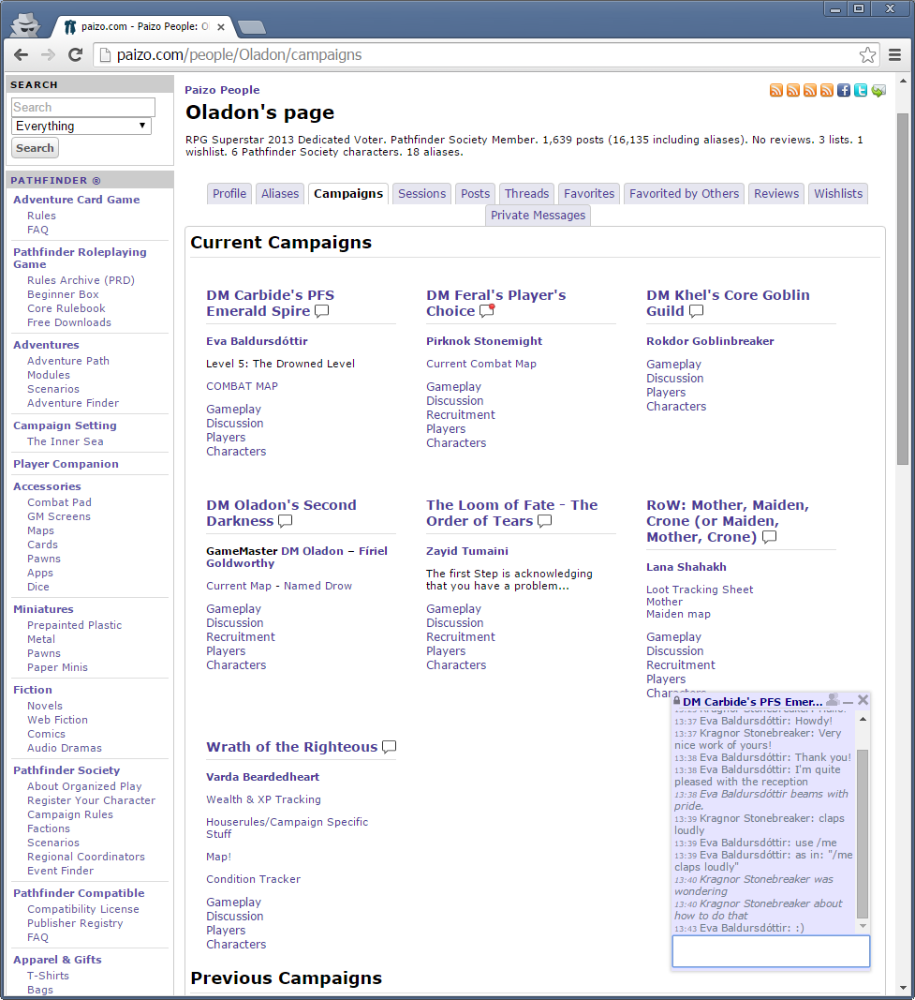
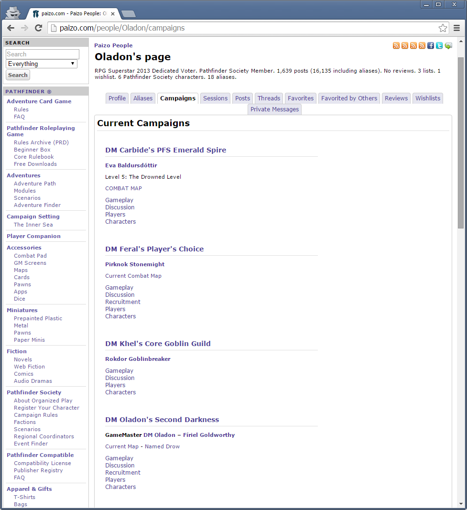

Paizo Campaign Tools
====================

There are five tools included in this bundle: the Alias Selector (lets you 
define an alias to use as your default posting alias on a per-campaign basis),
Arranger (rearranges the user campaigns page to be more readable [with less 
scrolling]), the User Blacklist (greys out or hides posts by certain users), 
Highlighter (highlights the "(x new)" link on campaign pages), and Campaign 
Chat (lets you chat live with other people in the same campaigns).

With PCT: 

Without PCT: 

C'mon now, how hard a decision is that?

For Opera users, the old user scripts are still available, but the User 
Blacklist feature is not included. If anyone's interested in teaming up 
to get a the Blacklist feature written for Opera, let me know!

**Firefox Installation:**

Download pct.xpi from the Mozilla add-ons site: 
https://addons.mozilla.org/en-US/firefox/addon/paizo-campaign-tools/

Alternatively:

1) Download the contents of firefox-add-on/ and place them in a zip file, 
   then rename the zip file to pct.xpi

2) Open Firefox, and drag pct.xpi onto the open Firefox window. Click 
   "Install Now", and you're done.

**Opera Installation:**

1) Download camparr.css and camparr.user.js from userscripts/.

1) Navigate to paizo.com

2) Right-click the page -> Edit Site Preferences. On the Display tab, add 
the path to camparr.css in "My style sheet".

3) In the same Site Preferences window, click on the Scripting tab, then 
under User JavaScript folder add the path to camparr.user.js. Done!

**Google Chrome Installation:**

Download the extension from the Google Chrome web store:
https://chrome.google.com/webstore/detail/paizo-campaign-tools/ibfgfbafipmhmjohndaekilkkldeahgd
